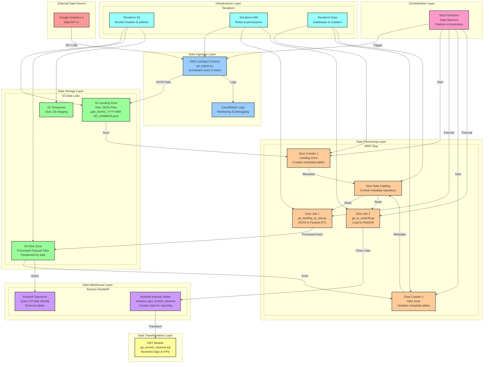

# Google Analytics 4 Pipeline - Architecture Diagram

## Complete System Architecture

## Detailed Component Architecture

### 1. Data Ingestion Flow

### 2. Data Processing Flow

### 3. Data Loading Flow

## Data Transformation Architecture

### DBT Model Structure

## Infrastructure Architecture

### AWS Resource Dependencies

## Security Architecture

### IAM Role Permissions

## Data Flow Architecture

### End-to-End Data Journey

## Monitoring Architecture

### Observability Stack

## Cost Optimization Architecture

### Resource Scaling Strategy

This architecture diagram provides a comprehensive view of how all components in your Google Analytics 4 pipeline work together, from data ingestion to final analytics, including security, monitoring, and cost optimization considerations. 